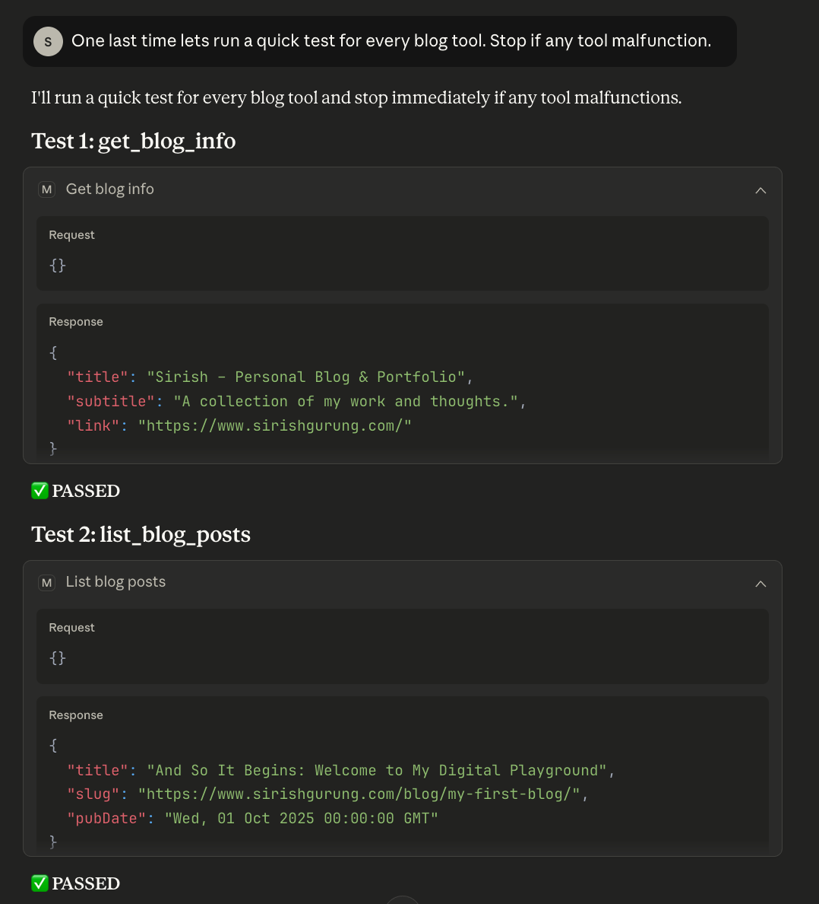

# 🌟Blog RSS MCP Server

A minimal Model Context Protocol (MCP) server that exposes tools for working with a blog’s RSS/Atom feed. It lists posts, fetches post content, returns recent posts, basic blog info, and can search post content on-demand.

## What’s in here

- `main_server.py` — MCP server with tools:
	- `list_blog_posts()` → [{title, slug (url), pubDate}]
	- `get_blog_post(slug)` → {slug, url, content} (content extracted from page HTML, preferring <article>)
	- `get_recent_posts(count=5)` → recent posts (simple reverse order)
	- `get_blog_info()` → blog metadata
	- `search_full_text(query)` → on-demand search (fetches each post and searches the text directly)
- `run_local_tests.py` — quick local smoke test that exercises the tools without starting the MCP server.
- `Dockerfile` — container image for running the server.
- `requirements.txt` — Python dependencies.

## Requirements

- Python 3.10+
- Recommended: a virtual environment (e.g., `.venv`)

Install dependencies:

```bash
pip install -r requirements.txt
```

Note for Python 3.13+: `feedparser` imports the removed stdlib module `cgi`; this repo includes `python-legacy-cgi` in requirements to ensure compatibility.

## Configuration

Set environment variables as needed:

- `RSS_FEED_URL` (required) → Full URL to your RSS/Atom feed (e.g., `https://example.com/feed.xml`)
- `MCP_TRANSPORT` (optional) → `stdio` (default), `sse`, or `streamable-http`
- `MCP_MOUNT_PATH` (optional) → mount path for applicable transports

Example:

```bash
export RSS_FEED_URL="https://www.sirishgurung.com/rss.xml"
export MCP_TRANSPORT=stdio
```

## Run locally (MCP server)

```bash
python main_server.py
```

With a venv:

```bash
.venv/bin/python main_server.py
```

## Local smoke test (no MCP client required)

```bash
.venv/bin/python run_local_tests.py
```

That script will print blog info, list posts, fetch one post’s content, and run a simple on-demand search.

## Docker

Build the image:

```bash
docker build -t blog-rss-mcp:latest .
```

Run with stdio transport (for MCP clients that spawn the container and talk over stdio):

```bash
docker run --rm -i \
	-e RSS_FEED_URL="https://www.sirishgurung.com/rss.xml" \
	-e MCP_TRANSPORT=stdio \
	blog-rss-mcp:latest
```

Run with basic HTTP transport (optional):

```bash
docker run -d \
	-e RSS_FEED_URL="https://www.sirishgurung.com/rss.xml" \
	-e MCP_TRANSPORT=streamable-http \
	-e MCP_MOUNT_PATH="/mcp" \
	-p 5000:5000 \
	--name blog-rss-mcp \
	blog-rss-mcp:latest
```

## Docker Desktop Setup With Claude Client
Prerequisites: Docker Desktop installed with MCP Toolkit enabled. Claude desktop installed.

1) **Build a Docker Image**: You first build a local Docker image named blog-mcp-server using the provided project files (Dockerfile, Python server, etc.).
```bash
docker build -t blog-rss-mcp:latest .
```

2) **Define the Tool**: You create a `~/.docker/mcp/catalogs/custom.yaml` file that acts as a "catalog." This file defines the new "blog" tool, lists all its functions (like list_blog_posts, get_blog_posts, and others), and tells the system to use the Docker image you just built.
```yaml
yamlversion: 2
name: blog-mcp-server
displayName: Blog RSS MCP Server
registry:
  blog-rss-mcp:
    description: "Local MCP server exposing blog RSS tools (list_blog_posts, get_blog_post, get_recent_posts, get_blog_info, search_full_text)."
    title: "Blog RSS MCP Server"
    type: server
    dateAdded: "2025-10-23T00:00:00Z"
    image: blog-mcp-server:latest
    ref: ""
    readme: "README.md"
    toolsUrl: ""
    source: ""
    upstream: ""
    icon: ""
    tools:
      - name: list_blog_posts
      - name: get_blog_post
      - name: get_recent_posts
      - name: get_blog_info
      - name: search_full_text
    metadata:
      category: productivity
      tags:
        - blog
        - rss
        - mcp
        - search
      owner: local
    env:
      - name: RSS_FEED_URL
        description: "URL to the blog RSS feed (required)."
        required: true
      - name: MCP_TRANSPORT
        description: "Transport used by FastMCP. Use 'stdio' for local client-managed lifecycle."
        default: "stdio"
      - name: MCP_MOUNT_PATH
        description: "Optional mount path for transports like SSE."
        default: ""

```

3) **Register the Tool**: You edit the `~/.docker/mcp/registry.yaml` file to officially register the new blog tool with the MCP (Model-Component-Processor) system.
```yaml
registry:
  blog-rss-mcp:
    ref: ""
```

4) **Configure Claude Desktop**: You edit the main claude_desktop_config.json file to tell the Claude application to load your new custom.yaml catalog file. 
	- macOS: ~/Library/Application Support/Claude/claude_desktop_config.json
	- Windows: %APPDATA%\Claude\claude_desktop_config.json
	- Linux: ~/.config/Claude/claude_desktop_config.json

You can also find an _Edit Config_ option in the Settings->Developers window.
This step requires adding the file path to the command arguments and ensuring your home directory path is correct.
```json
{
    "mcpServers": {
      "mcp-toolkit-gateway": {
        "command": "docker",
        "args": [
          "run",
          "-i",
          "--rm",
          "-v", "/var/run/docker.sock:/var/run/docker.sock",
          "-v", "[YOUR_HOME]/.docker/mcp:/mcp",
          "docker/mcp-gateway",
          "--catalog=/mcp/catalogs/docker-mcp.yaml",
          "--catalog=/mcp/catalogs/custom.yaml",
          "--config=/mcp/config.yaml",
          "--registry=/mcp/registry.yaml",
          "--tools-config=/mcp/tools.yaml",
          "--transport=stdio"
        ]
      }
    }
  }
```

5) **Restart and Test**: After restarting the Claude Desktop app, the new blog functions will be available. You can test them by asking Claude to "get recent blogs" or "list all blogs"

## Output Samples




## Notes & troubleshooting

- You can add your rss link to RSS_FEED_URL in the dockerfile to make it the default.
- Logs go to stderr; stdio transport messages go to stdout (safe for MCP clients).
- If HTTPS feed fetches fail in a minimal base image, install system CA certificates in your container.
- If `mcp.run()` signature changes between versions, inspect `FastMCP.run` in your installed package and adjust the call accordingly.
